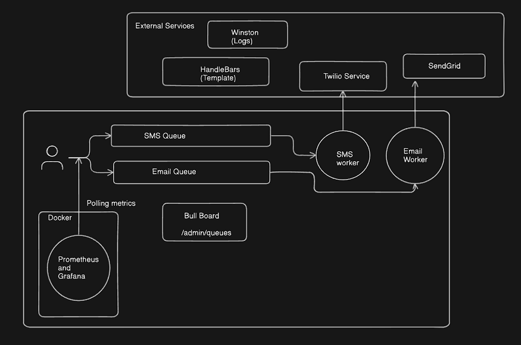

# 🚀 Async Notification System

A scalable, asynchronous **Notification Service** built in **Node.js** with **TypeScript** that handles background **Email and SMS** notifications reliably using queues, monitoring, and comprehensive logging.


## ✨ Features

- **🔄 Asynchronous Processing**: Queue-based notification handling with Bull
- **📧 Multi-Channel Support**: SMS (Twilio) + Email (SendGrid) 
- **📬 Bulk Notifications**: Send notifications to multiple recipients efficiently
- **⚡ Priority Handling**: Urgent vs normal message prioritization
- **🔄 Retry Mechanism**: Exponential backoff for failed deliveries
- **📝 Dynamic Templates**: Handlebars-style templating engine
- **📊 Real-time Monitoring**: Bull Board UI + Prometheus metrics
- **🔍 Comprehensive Logging**: Winston-based structured logging
- **📈 Grafana Dashboard**: Visual monitoring and analytics
- **⚙️ Process Management**: PM2 integration for production deployment

## 🛠 Tech Stack

- **Runtime**: Node.js + TypeScript
- **Framework**: Express.js
- **Queue System**: Bull (Redis-based)
- **Monitoring**: Bull Board + Prometheus + Grafana
- **Logging**: Winston
- **SMS Provider**: Twilio
- **Email Provider**: SendGrid
- **Process Manager**: PM2
- **Template Engine**: Handlebars
- **Rate Limiting**: express-rate-limit

## 🏗 Architecture



## 📦 Installation

### Setup

1. **Clone the repository**
   ```bash
   git clone https://github.com/Abhijit-Jha/devifyx-notification-system.git
   cd devifyx-notification-system
   ```

2. **Install dependencies**
   ```bash
   npm install
   ```

3. **Environment Configuration**
   ```bash
   cp .env.example .env
   # Configure your environment variables
   ```

4. **Start Redis**
   ```bash
   # Using Docker
   docker run -p 6379:6379 -d redis:8.0-rc1
   
   REDIS_URL=redis://localhost:6379 (put in .env)
   # Or install locally
   redis-server
   ```

5. **Start the monitoring stack**
   ```bash
   docker-compose up -d

   Prometheus : http://localhost:9090
   Grafana : http://localhost:3001 (Credentials Given below)
   ```

6. **Build and start the application**
   ```bash
   npm run pm2
   ```

## 📡 API Documentation

### Base URL
```
http://localhost:3000
```

### 1. Add Single Notification Job

**Endpoint**: `POST /api/addJob`

**Request Body**:
```json
{
    "type": "email",
    "to": "abhijeetjha204@gmail.com",
    "subject": "Welcome",
    "template": "welcome",
    "isPriority": true
}
```

**Response**:
```json
{
    "message": "Email Job added successfully",
    "jobId": "32"
}
```

**SMS Example**:
```json
{
    "type": "sms",
    "to": "+1234567890",
    "message": "Your verification code is 123456",
    "isPriority": false
}
```

### 2. Add Bulk Notification Jobs

**Endpoint**: `POST /api/addBulkJobs`

**Request Body**:
```json
{
    "type": "email",
    "to": [
        "user1@example.com",
        "user2@example.com",
        "user3@example.com"
    ],
    "isPriority": false,
    "subject": "Hello and welcome",
    "template": "welcome"
}
```

**Response**:
```json
{
    "message": "Bulk Email jobs added successfully",
    "count": 3
}
```

### Request Parameters

| Parameter | Type | Required | Description |
|-----------|------|----------|-------------|
| `type` | string | ✅ | Notification type: `"sms"` or `"email"` |
| `to` | string/array | ✅ | Recipient(s) - single string or array for bulk |
| `subject` | string | ✅ (email only) | Email subject line |
| `message` | string | ✅* | Custom message content |
| `template` | string | ✅* | Template name (e.g., "welcome") |
| `isPriority` | boolean | ✅ | Priority flag (true = urgent, false = normal) |

*Either `message` or `template` is required


## 📊 Monitoring & Observability

### Bull Board Dashboard
Access the queue management interface at:
```
http://localhost:3000/admin/queues
```

Features:
- View active, waiting, completed, and failed jobs
- Retry failed jobs manually
- Monitor queue statistics
- Real-time job processing updates

### Prometheus Metrics
Metrics endpoint:
```
http://localhost:3000/metrics
```

Available metrics:
- `Total_Request_Count` - Total HTTP requests
- `TOTAL_ACTIVE_USERS` - Current active requests
- `cumulative_data_of_user` - Request duration histogram

### Grafana Dashboard
Access visual monitoring at:
```
http://localhost:3001
```

Default credentials:
- Username: `admin`
- Password: `admin`


## 📝 Templates

### Available Templates

Currently supported templates:
- `welcome` - Welcome message for new users


## 🚨 Error Handling

### Retry Mechanism
- **Attempts**: 3 retries per job
- **Backoff**: Exponential (5s, 25s, 125s)
- **Failed Jobs**: Retained for debugging
- **Completed Jobs**: Automatically removed

### Logging Levels
- `info` - Successful operations
- `warn` - Validation failures
- `error` - System errors and API failures


# How AI Helped Me in This Project

### 1. Planning and Organizing Tasks
- Task breakdown and prioritization
- Timeline estimation
- Milestone planning
- Risk assessment

### 2. Writing Logs (Winston)
- Logger configuration setup
- Structured logging formats

### 3. Code Structure
- File organization and architecture
- Design pattern implementation
- Code modularity
- Error handling patterns

### 4. Writing README File
- Documentation structure
- Installation guides
- Usage examples
- API documentation

### 5. Automating Boring Tasks
- Boilerplate code generation
- Structuring the code
